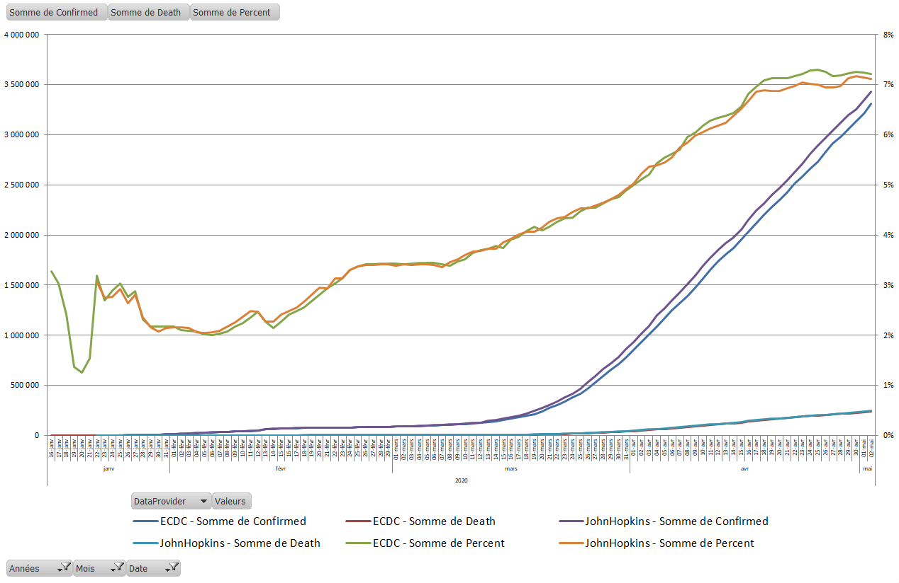

# Covid19
## Purpose
I created this project in order to see the evolution of the Covid19 pandemia spread. It generates one single CSV file of confirmed cases, death, by location and day.

## Johns Hopkins University
Once I saw this dashboard [COVID-19 Dashboard by the Center for Systems Science and Engineering (CSSE) at Johns Hopkins University (JHU)](https://www.arcgis.com/apps/opsdashboard/index.html#/bda7594740fd40299423467b48e9ecf6), I decided to download there data, available in this [GitHub repository](https://github.com/CSSEGISandData/COVID-19), in order to make my onwn graphs.

## European Centre for Disease Prevention and Control (ECDC)
Then I used also [ECDC daily geographic distribution](https://www.ecdc.europa.eu/en/publications-data/download-todays-data-geographic-distribution-covid-19-cases-worldwide).

## Difficulties
### Data formats
All along collection of data, both institutes have changed their data format, support files types, date format, column names and number, incremental counting or not. This lead to miss calculations and bad results. I tried to adapt my code to be able to handle these evolutions.

### Locations
Geographic coordinates where missing or inaccurate. Then I decided to use [Bing Map API](https://docs.microsoft.com/en-us/bingmaps/rest-services/) to update latitude and longitude.

## Missing data
ECDC may not generate data for some perticular days and location. In order to preserve data continuity, I've had to create missing data.
